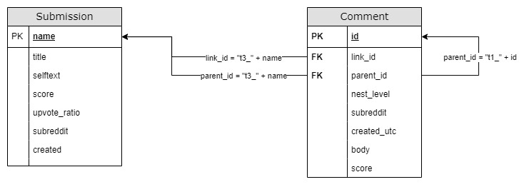

# PEP_Privacy_Dev_Forum_Analysis
Repository for code related to the COS 535 Project - Analysis of Reddit Privacy Questions and Answers Adults
## Project Team Members
Jonathan Parsons  
Oyebanjo (Banjo) Ogunlela  
Michael Schrider

## Project Description
Reddit covers various software development topics. In this project, you are expected to first
conduct a literature review on the current approaches and results related to the analysis of
developers’ forums and discuss their results, and their shortcomings. Then propose an
improvement to the current approaches to create insights about the concerns and privacy
challenges of developers on Reddit. You are expected to extract information about developers'
questions related to regulations; privacy engineering practices; the solutions proposed by other
developers; the most answered questions; and the most accepted/rejected answers, etc. You will
also examine what the trends of questions or answers are pre- vs post-GDPR, CCPA and other
similar regulations and then report the results. You are expected to at least evaluate 100 Q/As in
the last five years. In addition to the paper, you are expected to make your dataset, tool, all other
relevant artifacts available on GitHub.

## Git Project Scope
This git project is intended to keep a record of and allow easy reproduction of the data and analysis used in the Reddit privacy analysis. The three subreddits targeted for analysis are /r/androiddev, /r/iOSprogramming, and /r/webdev. Static datasets for these three subreddits used for the Reddit privacy analysis are included and can be used to directly reproduce this project's work.

Code within this project can potentially be leveraged to analyze privacy behavior of other subreddits but compatibility is not guaranteed.

# Dependencies and Prerequisites - WIP
## Python Library Dependencies - WIP
This project is built from the following python libraries:
* [Python Reddit API Wrapper (PRAW)](https://praw.readthedocs.io/en/stable/getting_started/authentication.html "Python Reddit API Wrapper (PRAW)")
* [PMAW: Pushshift Multithread API Wrapper](https://github.com/mattpodolak/pmaw "PMAW: Pushshift Multithread API Wrapper")
* [Pandas](https://pandas.pydata.org/ "Pandas")
* [matplotlib](https://matplotlib.org/ "matplotlib")
* [Natural Language Toolkit (nltk)](https://www.nltk.org/ "nltk")
* [Gensim](https://radimrehurek.com/gensim/ "gensim")
## Reddit Account and Application Registration
For fetching up to date Reddit posts, this project requires a read only connection with Reddit. This connection is not required if only static datasets from github are used. 

The suggested way to setup a connection is using [PRAW OAuth](https://praw.readthedocs.io/en/stable/getting_started/authentication.html) from PRAW for a registered Reddit Script Applicaiton.

In order to register a script application with reddit, a Reddit account is required. Reddit applications can be registered at: https://www.reddit.com/prefs/apps/

To use PRAW OAuth, connection details based on the registered account/application need to be provided, an easy way to do this is in the praw.ini file ([How to setup configuration file](https://github.com/mschrider/PEP_Privacy_Dev_Forum_Analysis/edit/main/README.md#setup-configuration-file)).

# How to Use

## Directly Running with Static Datasets
After setting up the project, the simpliest method to directly reproduce the outputs of this project using the static datasets in github is to run the following:   
```python
import reddit_privacy_analysis 
reddit_privacy_analysis.run_project(fetch_data=False)
```
This will generate several matplotlib objects and produce csv outputs in the current python working directory.
Running this for all subreddits in the config file can take 10-30mins depending on your processor even when using existing datasets.

## Run a Single Subreddit
After setting up the project, complete analysis of a single subreddit can be completed with the run_subreddit command. A raw subreddit dataframe and the subreddit (as a string) need to be provided.
```python
run_subreddit(df, subreddit)
```

## NLTK Corpus files
Downloading NLTK corpus files is needed to run this project. This can most easily be accomplished by running the following code to start the NLTK download manager.
```python
import nltk 
nltk.download()
```

## Setup Configuration File
Setting up a After cloning or otherwise getting this project down to use, the praw.ini file needs to be updated with login information.

The *client_id* and *client_secret* parameters are obtained when registering a Reddit application and if you have a registered app can be found at https://www.reddit.com/prefs/apps/.

The value in *user_agent* does not matter.

The *username* and *password* parameters need to be associated with a Reddit account that is a devloper of the app referenced in *client_id*.

This ini file will contain your Reddit password, so be sure to **NOT** share a filled in praw.ini unintentionally. 
```
[DEFAULT]
client_id=YOUR_REGISTERD_APP_ID
client_secret=YOUR_REGISTERD_APP_SECRET_ID
user_agent=USER_AGENT_NAME
username=REDDIT_APP_DEVELOPER_ACCOUNT_USER_NAME
password=REDDIT_APP_DEVELOPER_ACCOUNT_PASSWORD
```
Other methods for providing the connection information can be used; see [PRAW OAuth](https://praw.readthedocs.io/en/stable/getting_started/authentication.html) for details.


## Loading Data
### Load Existing Dataset
This project includes pre-pulled static datasets, these can be loaded into Pandas dataframes.
```python
import pandas as pd

data = pd.read_csv('Data/webdev_submissions_raw_data.zip')
```

### Query Reddit for New Data
Up to date Reddit can be fetched. Getting current data requires a connection with Reddit, see [How to setup configuration file](https://github.com/mschrider/PEP_Privacy_Dev_Forum_Analysis/edit/main/README.md#setup-configuration-file) for instructions on how to enable an authorized connection with Reddit. Newly fetched data will need to be cleansed see [Cleansing Fetched Data](https://github.com/mschrider/PEP_Privacy_Dev_Forum_Analysis/edit/main/README.md#cleansing-fetched-data---tbd)
```python
import reddit_data
import praw
from pmaw import PushshiftAPI
from datetime import datetime

reddit = praw.Reddit()
api = PushshiftAPI(praw=reddit)
print('Connected as: %s' % reddit.user.me())
before = int(datetime.strptime("11/01/2022", '%m/%d/%Y').timestamp())
after = int(datetime.strptime("07/12/2009", '%m/%d/%Y').timestamp())
data = reddit_data.submissions(api, subreddit, before=before, after=after)
```
Fetching new data can take hours to days depending on the status of the pushshift servers. Please be patient with the process and be prepared to run it several times as interruptions/fails are not uncommon.

### Cleansing Fetched Data
Reddit data needs to be cleansed and prepped prior to use. The clean_submission function removes emojis, converts the reddit UTC timestamp to a more user friendly format, removed deleted/removed posts, and renames the 'selftext' field to the more intuitive 'body' field.
```python
cleaned_data = clean_submission(data)
```

### Prepping Data - Tokenization and Lemmatization
Prior to processing with NLTK reddit data must be tokenized (turned into a bag of words) and words must be lemmatized (reduced to their 'root' form).
The token_lemmat_prep function accomplishes both these tasks by leveraging NLTK's WordNetLemmatizer and the default NLTK tokenizer.
```python
token_lemmat_data = token_lemmat_prep(cleaned_data, ['title', 'body'])
```

### Prepping Data - Data Tagging
Data tagging tags each row of a cleaned dataset if the specified columns contain any of the privacy keywords in **Config/analysis_settings.json**.
```python
df = tag_reddit_data(cleaned_df, ['title', 'body'])
```

## Producing Analysis Outputs
Details on the implementation of the analysis are located in [Data Analysis](https://github.com/mschrider/PEP_Privacy_Dev_Forum_Analysis/edit/main/README.md#data-analysis---tbd).

### Question Topic Analysis
The topic analysis returns a dictionary of common topics. The run_subreddit() function runs this repeatadly against different subsets of reddit data and outputs the results as CSV files in the Outputs directory.
```python
topic_df = privacy_questions(tagged_, ['title'])
privacy_topics = topic_analysis(topic_df, ['lemmatized_title', 'lemmatized_body'])
```

### Sentiment Graphs
First a sentiment score must be generated via:
```python
neutrality_width = 0.1
columns_to_analyze = ['title', 'body']
sentiment_df = submissions_sentiment_analysis(cleaned_df, columns_to_analyze, neutrality_width)
```

Then the sentiment can be graphed. This includes markers for pre and post regulation (GDPR and CCPA).
```python
subreddit = 'androiddev'
target_columns = ["created_utc", "title_sentiment", "body_sentiment"]
sentiment_graphing(sentiment_df, subreddit, target_columns)
```

### Run All Analysis
Running all analysis at once to produce three matplotlib objects and output CSVs (for topics with differnet subsets of reddit data)
```python
data = pd.read_csv('Data/webdev_submissions_raw_data.zip')
run_subreddit(data, 'webdev')
```

# Data Analysis


## ERD and Format of Reddit Data
Reddit data pulled in this project is submissions (posts) and comments. The primary key for submissions is the **name** field. This analysis used a praw instance as the basis for the pmaw api, this results in the queried submissions primary key being called **name**. Other methods of pulling of reddit posts may call this field **id**. The primary key for comments is the **id** field. Comments exist either as children under a submission or under other comments (which themselves exist under either submissions or comments). The **parent_id** links the comment to the parent submission **name** (the **parent_id** is prepended with "t3_" compared to the **name**). The **parent_id** field on the comment indicates the immediate parent submission or comment; if the parent is a comment the **parent_id** is prepended with a "t1_" and if the parent is a submission the **parent_id** is prepended with a "t3_". The **nest_level** field indicates the nested distance from the comment to its source parent submission.


## Sentiment Analysis
The sentiment analysis uses the [Vader](https://medium.com/@piocalderon/vader-sentiment-analysis-explained-f1c4f9101cd9) sentiment analysis in [NLTK](https://www.nltk.org/_modules/nltk/sentiment/vader.html)

## Topic Analysis
The topic analysis uses Latent Dirichlet allocation ([LDA](https://en.wikipedia.org/wiki/Latent_Dirichlet_allocation)) to identify common topics. Prior to the LDA analysis being conducted the reddit submissions are first filtered for privacy related questions. This is accomplished using a Naive Bayes Classifier trained on NLTK NPS Post Corpus data to identify questions and then filtering to submissions with privacy keywords.  
